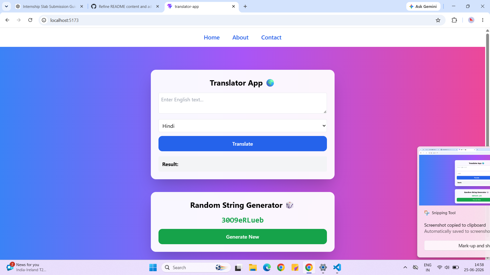
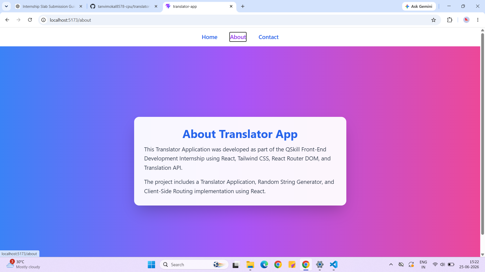
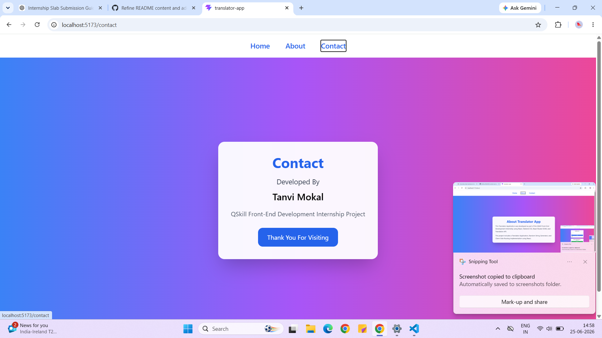
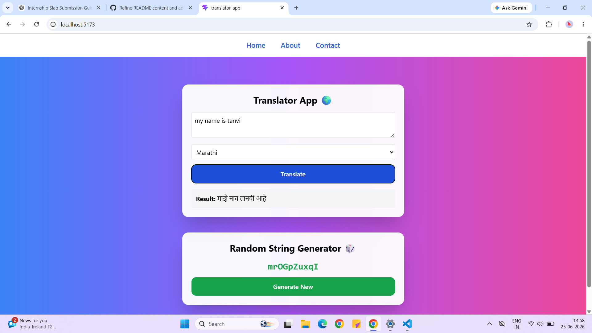

# 🌍 Translator App

A modern and responsive Translator Application built using **React.js** and **MyMemory Translation API**. This application allows users to translate English text into multiple languages with a simple and user-friendly interface.

---

## 🚀 Features

✅ Translate English text into multiple languages

✅ Support for:

* Hindi
* Marathi
* French
* Spanish
* German

✅ Clean and Responsive UI

✅ Real-Time Translation

✅ Navigation Bar

* Home Page
* About Page
* Contact Page

✅ Random String Generator

---
## 📸 Screenshots

### Home Page


### About Page


### Contact Page


### Translation Output


## 🛠️ Tech Stack

* React.js
* JavaScript (ES6+)
* Tailwind CSS
* MyMemory Translation API
* Vite


## ⚙️ Installation

### Clone Repository

```bash
git clone https://github.com/tanvimokal8578-cpu/translator-app.git
```

### Navigate to Project Directory

```bash
cd translator-app
```

### Install Dependencies

```bash
npm install
```

### Run Development Server

```bash
npm run dev
```

Application will start on:

```text
http://localhost:5173
```

## 📂 Project Modules

### Translator Module

* Accepts English text input
* Select target language
* Translate text instantly
* Display translated output

### Random String Generator

* Generates random strings dynamically
* Demonstrates React State Management

### Navigation Module

* Home Page
* About Page
* Contact Page

---

## 🔮 Future Enhancements

* Speech-to-Text Translation
* Text-to-Speech Support
* Translation History
* Auto Language Detection
* Dark Mode
* More Language Support

---

## 👩‍💻 Author

**Tanvi Mokal**

Developed as part of the **QSkill Internship Learning Program**.

---

## 📜 License

This project is created for educational and internship learning purposes.
